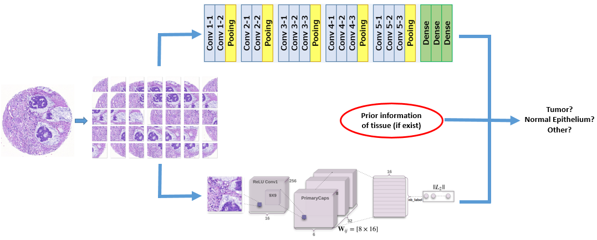

# Implementation: Deep learning for classification of colorectal tissue TMA images 

## Method
</img>

## Requirements
- Python 3
- openslide
- NumPy 1.13.1
- Tensorflow 1.3.0
- Sklearn: 0.18.1
- Matplotlib

   
## Train

    $> python train.py <dataset> [<output>]  (in folder capsnet). Thanks to the implementation of https://github.com/thibo73800/capsnet-traffic-sign-classifier
    $> python train_network.py --dataset <dataset> (in folder CNN). 

During the training, the checkpoint is saved by default into the outputs/checkpoints/ folder. The exact path and name of the checkpoint is print during the training.

## Test

In order to measure the accuracy and the loss on the Test dataset you need to used the test.py script as follow:

    $> python test.py outputs/checkpoints/ckpt_name dataset/ 

## Example of result

</img>

